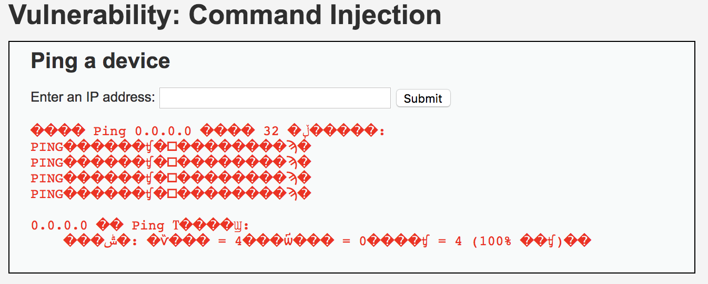

## Command Injection

很久没有更新，也很有没有玩过`DVWA`、`Web for Pentester`等等一系列的渗透测试练习平台，最近又突然重新开始搞一下，发现原来很有都没有做，还有很多方法和技巧都已经生疏，甚至忘记，那就重新开始整理记录吧。

### 练习示例

下面是该练习的示例，通过在输入框中输入构造的字符串，实现命令注入的功能。

如果想要实现命令注入的功能，直观想法就是在输入框中输入想要执行的命令。从上图中可以看出（虽然很多乱码），该测试平台运行在`windows`系统上，所以只能执行一些windows命令，如`dir`、`ipconfig`等进行测试。另外，进行简单测试之后，可以发现虽然该页面没有对输入进行验证，但是如果直接输入命令，如`dir`会提示出错，猜想代码应该是`ping $ip`，所以为了实现命令注入，考虑一行执行多条命令。

### 多命令执行

在windows操作系统中，存在三个操作符，可以实现一行运行多条命令：`&`、`&&`、`||`。

* `&`

示例：`a & b`  
含义：先运行`a`命令，再运行`b`命令  
说明：无论`a`命令执行是否成功，`b`命令都会执行

* `&&`

示例：`a && b`  
含义：先运行`a`命令，如果`a`命令执行成功再执行`b`命令  
说明：如果`a`命令执行失败，就直接退出，不再执行`b`命令。可以理解为`与`操作，命令运行成功返回`1`，运行失败返回`0`。

* `||`

示例： `a || b`  
含义：先运行`a`命令，如果`a`命令执行失败再执行`b`命令  
说明：如果`a`命令执行成功，直接退出，不再执行`b`命令。可以理解为`或`操作。

### Level-{low}

所以，如果想要实现命令注入，输入`0.0.0.0 & dir`即可。

## References

\[1\][Windows7环境下命令行一次运行多条命令][1]  

[1]: https://blog.csdn.net/automation13/article/details/76285401
