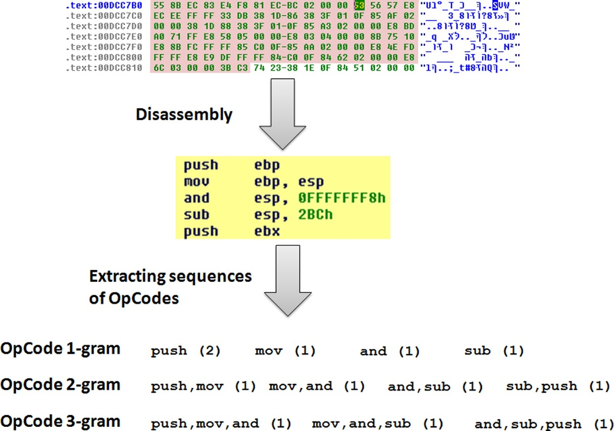

## Malware Images

### [Malware Images: Visualization and Automatic Classification][]

---

该文章发表于`2011`年，不同于传统恶意软件检测方法，首次提出`恶意代码图像（Malware Images）`的概念，使用`恶意代码图像`来对恶意软件进行分类。在文章的实验中，对`25`类共计`9548`种恶意代码进行分类，准确率（accuracy）达到`98%`,而且文章中介绍，该种方法不需要`反汇编（disassembly）`和`执行（execution）`.此外，对`代码混淆（obfuscation）`也具有一定的适应能力.

该文章首先对恶意软件进行可视化，转换为灰度值图像。首先，读入恶意软件的二进制（binary）文件，将其作为一个`8`位的向量，因为每个二进制文件的字节范围在`Ox00-0xFF`之间，正好与灰度值`0-255`对应(`0`为`黑色`，`255`为`白色`)。这样就可以将恶意软件转换为一个`2D`的数组，数组中的元素对应恶意软件的一个二进制字节，数组的宽度也就是图像的宽度可以根据实际情况进行调整。文章中根据文件大小设定了一些图像宽度。通过上述步骤，就可以很方便地将这个`2D`数组转换为`灰度值图像`，即得到了恶意软件的`恶意代码图像`。下图是文章中的一个例子

在提取到恶意代码图像之后，文章使用了`GIST特征`，来对图像进行描述。`GIST`特征主要用来做场景识别和物体识别。

最后，基于图像的`GIST特征`，通过`K近邻（K-nearest）`算法，使用`欧式距离（Euclidean Distance）`来训练分类其，并用`10 flod cross validation`来对分类器进行验证。

分类器参数总结如下

|**Feature**   |GIST: 320 dimension          |
|**Algorithm** |K-nearest: k = 3             |
|**Distance**  |Euclidean Distance           |
|**validation**|10 flod cross validation     |
|**Dataset**   |Anubis analysis system       |
|**Label**     |Microsoft Security Essentials|
|**Result**    |[Malware Images][]           |

## OpCode Patterns

### [Detecting unknown malicious code by applying classification techniques on OpCode patterns][]
---

该文章于`2012`年发表在`Security Informatics`上.这篇文章提出使用`OpCode n-gram patterns`进行恶意代码分类.在文章实验中，验证了不同配置和不同特征情况下`8`种不同的分类器对超过`30000`个文件的分类能力.同时,针对真实环境中恶意代码(malicious code)和良性代码(benign code)不平衡问题(imbalance problem),进行了不同比例的模拟.通过实验验证，实验结果的准确率(accuracy)超过`96%`(TPR: 0.95, FPR:0.1).相比于之前使用`byte n-gram patterns`的方法有了小幅提高.

文章首先对可执行文件(executable)进行`反汇编`,得到可执行文件的反汇编代码，然后根据不同的gram大小(即n)提取`OpCode`.文章使用`IDA-Pro`对可执行文件进行反汇编.文章中提到对于某些加壳的可执行文件，首先尝试使用`Armadillo`,`UPX`或者`Themida`工具进行脱壳，如果无法脱壳，就使用可执行文件的`byte n-gram`作为特征进行提取。引用文章中的一张例图

接下来文章通过3组实验分别对特征表示的配置、imbalance problem和演化能力进行实验

* 第1组实验

该组实验通过控制变量的方法从5个方面进行了比较

* the term representation (TF/TF-IDF)
* the OpCode n-gram size (1, 2, 3, 4, 5, 6)
* the top-selection of features (50, 100, 200, 300)
* the feature selection method (DF, FS, GR)
* the classifier (SVM, LR, RF, ANN, DT, BDT, NB, BNB)

实验中, 训练集和测试集都是按照真是情况下设置恶意代码和良性代码的比例(Malicious File Percentage, MFP: 22%),使用5-fold cross validation的方法进行验证.分类器采用TPR(True Positive Rate),FPR(False Positive Rate), Accuracy和G-Means作为衡量指标.

通过实验得到分类器最佳配置和性能比较好的分类器

|**Term representation**|TF                        |
|**OpCode n-gram size** |n = 2                     |
|**Top-selection**      |Top 300                   |
|**Feature selection**  |DF                        |
|**Classifier**         |SVM, LR, RF, ANN, DT, BDT |

* 第2组实验

该组实验是验证最佳训练集中最佳的MFP(Malicious File Percentage)

实验配置如下

|**Term representation**|TF                        |
|**OpCode n-gram size** |n = 2                     |
|**Top-selection**      |Top 300                   |
|**Feature selection**  |DF                        |
|**Classifier**         |SVM, LR, RF, ANN, DT, BDT |
|**Test Set MFP**       |10-15%                    |
|**Trainning Set MFP**  |5%, 10%, 15%, 30%,50%     |
|**Validation**         |2-fold cross validation   |

通过实验验证，得到在训练集中MFP大约为10%的泛化能力最强.

* 第3组实验

该组实验验证了多长时间对分类器训练一次能够保持分类器对新恶意代码的分类能力

> How often should a classifier be trained with recent malicious files in order to improve the detection accuracy of new malicious files?

|**Term representation**|TF                        |
|**OpCode n-gram size** |n = 2                     |
|**Top-selection**      |Top 300                   |
|**Feature selection**  |DF                        |
|**Classifier**         |SVM, LR, RF, ANN, DT, BDT |
|**Test Set MFP**       |10%                       |
|**Trainning Set MFP**  |50%                       |
|**Validation**         |2-fold cross validation   |
|**Data Set Year**      |2000 - 2007               |

总得来说，这篇文章创新点并不突出，只是提出了使用`OpCode n-gram patterns`作为特征进行分类，并对特征的不同配置和不同分类器进行了实验验证，同时也针对`imbalance problem`和`时间演化能力`进行了实验验证.文章的工作量大于贡献.

### [Method of Detecting Malware Through Analysis of Opcodes Frequency with Machine Learning Technique][]
---

该文章发表在`2016`年`the 8th International Conference on Computer Science and its Applications (CSA-16)`上。

文章提出使用`OpCode Frequency`作为特征，识别未知文件是良性（benign）代码还是恶意（malicious）代码。文章中提到文件识别准确率达到`94.3%`，而且认为数据量越大，文件识别准确率会越高。此外，文章还提出将`OpCode`检测模块，放在`SQN(SDN Quarantined Network)`中的`First Quarantined Station`来对未知文件进行分析。

文章中实验数据也是采用如下[VX Heaven][]的作为恶意样本，从`Win7`系统中提取系统文件作为良性样本

|**Benign**|win32 directory in Windows 7|10000|
|**Malicious**|VX Heaven|270000|

文章实验具体配置如下

|**Feature**|OpCode|28|
|**Algorithm**|Decision Tree|Classification & Regression Tree|
|**Trainning Set**|1:1(mal:benign)|
|**Test Set**|1000 malicious files|
|**Measure**|Cramer's V|

文章中使用的`28`个`OpCode`特征如下

总体来说，文章创新点不突出，贡献不足，而且文章中很多细节以及基本问题也没有交待清楚，主要问题如下

* 违背I.I.D.原则

实验中，Trainning Set和Test Set使用相同的数据，都是从VX Heaven数据集中随机选取，实验结果有待商榷

* imbalance problem

文章中MFP全部为`50%`，与实际情况不符，而且并没有对该问题进行解释

* obfuscation

文章中对程序混淆，如程序使用压缩壳、保护壳加密的情况。怀疑文章作者是忽略这些情况，直接对样本进行反汇编

[Malware Images: Visualization and Automatic Classification]: http://dl.acm.org/citation.cfm?id=2016908
[Malware Images]: http://vision.ece.ucsb.edu/~lakshman/malware_images/album
[Detecting unknown malicious code by applying classification techniques on OpCode patterns]: http://security-informatics.springeropen.com/articles/10.1186/2190-8532-1-1
[Method of Detecting Malware Through Analysis of Opcodes Frequency with Machine Learning Technique]: http://link.springer.com/chapter/10.1007/978-981-10-3023-9_158
[VX Heaven]: http://vxheaven.org/
