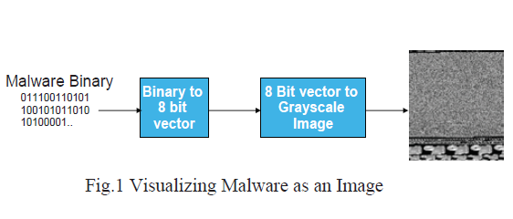

## Malware Images

> [Malware Images: Visualization and Automatic Classification][]

该文章发表于`2011`年，不同于传统恶意软件检测方法，首次提出`恶意代码图像（Malware Images）`的概念，使用`恶意代码图像`来对恶意软件进行分类。在文章的实验中，对`25`类共计`9548`种恶意代码进行分类，准确率（accuracy）达到`98%`,而且文章中介绍，该种方法不需要`反汇编（disassembly）`和`执行（execution）`.此外，对`代码混淆（obfuscation）`也具有一定的适应能力.

该文章首先对恶意软件进行可视化，转换为灰度值图像。首先，读入恶意软件的二进制（binary）文件，将其作为一个`8`位的向量，因为每个二进制文件的字节范围在`Ox00-0xFF`之间，正好与灰度值`0-255`对应(`0`为`黑色`，`255`为`白色`)。这样就可以将恶意软件转换为一个`2D`的数组，数组中的元素对应恶意软件的一个二进制字节，数组的宽度也就是图像的宽度可以根据实际情况进行调整。文章中根据文件大小设定了一些图像宽度。通过上述步骤，就可以很方便地将这个`2D`数组转换为`灰度值图像`，即得到了恶意软件的`恶意代码图像`。下图是文章中的一个例子

在提取到恶意代码图像之后，文章使用了`GIST特征`，来对图像进行描述。`GIST`特征主要用来做场景识别和物体识别。

最后，基于图像的`GIST特征`，通过`K近邻（K-nearest）`算法，使用`欧式距离（Euclidean Distance）`来训练分类其，并用`10 flod cross validation`来对分类器进行验证。

分类器参数总结如下

|Feature   |GIST: 320 dimension          |
|Algorithm |K-nearest: k = 3             |
|Distance  |Euclidean Distance           |
|validation|10 flod cross validation     |
|Dataset   |Anubis analysis system       |
|Label     |Microsoft Security Essentials|
|Result    |[Malware Images][]           |

[Malware Images: Visualization and Automatic Classification]: http://dl.acm.org/citation.cfm?id=2016908
[Malware Images]: http://vision.ece.ucsb.edu/~lakshman/malware_images/album
