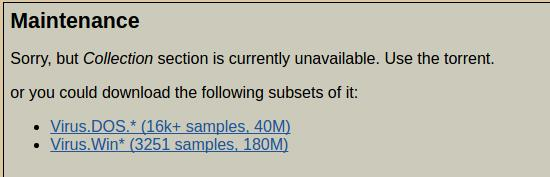

## [VX Heaven][]

`VX Heaven`在很多恶意代码分类的文章中都有提到，应该算是一个不错的数据集，一开始进入这个网站并没有找到想要的数据集。通过这两天的分析查找，发现了两个有意思的链接，一个是`source code of computer viruses`，一个是`computer virus collection`，通过名字就可以知道这两个链接的意思。链接如下:

- source: [http://vxheaven.org/src.php?show=all][1]
- collection: [http://vxheaven.org/vl.php][2]

### Virus Source

> [http://vxheaven.org/src.php?show=all][1]

该链接提供的`virus`总共有`375`个,基本都是`virus`的汇编文件，可以直接提取`opcode`.文件数量虽然不是很多，但是一个一个点击下载还是比较麻烦，而且链接点击进去之后是关于恶意程序的具体介绍，也无法使用迅雷下载页面全部链接，考虑使用爬虫获取页面所有链接，并进一步下载所有文件和恶意程序的具体描述信息。下面对关键步骤进行记录一下，完整代码可以参考Github上的[vxheaven.py][].

使用正则匹配，解析[virus source][1]文件列表

```
def GetMalcode(url):
    soup = GetPage(url)

    results = soup.findAll('a', {'href': re.compile(r'/src.php\?info=(.+)')})
    for result in results:
        tmp = result.get('href')
        src_url = ''.join(['http://vxheaven.org', tmp])
        GetMalInfo(src_url)
```

解析`virus`具体信息,包括`title`, `description`, `author`, `upload time`, `file name`.因为并不是所有页面都包含这些信息，所以要对作简单的判断，不然程序会抛出异常

```
tmp = result.find('h2')
    if tmp:
        malTitle = tmp.renderContents()

    malDesc = ''
    malAuthor = ''
    malDate = ''

    tmp = result.findAll('p')
    lenth = len(tmp)

    if (lenth > 0):
        malDesc = tmp[0].renderContents()

        if (lenth > 1):
            malAuthor = tmp[1].renderContents()

            if (lenth > 2):
                malDate = tmp[2].renderContents()
```

解析`virus`下载地址.页面中下载文件是通过`post`提交`form`来获取文件下载链接，通过模拟操作发现会有一步人机验证，导致响应`403 forbidden`的问题.通过分析下载链接，发现可以通过`base64`解码提交参数，拼凑出文件下载链接.

```
tmp = result.find('input', {'type': 'hidden'}, {
                      'name': 'file'}).get('value')
    tmp = tmp.replace('@', '=')
    malFile = base64.b64decode(tmp)
    malSrc = ''.join(['http://vxheaven.org/dl/', malFile])
```

### [Virus collection][2]

该链接提供了`virus`的可执行程序集合，页面列表根据`Kaspersky`的检测结果进行命名.点击进入链接一直到下载文件页面会得到提示


根据提示可以下载到两个`virus collection`的`subset`，其中

* Virus.Dos文件中包含`16862`个文件
* Virus.Win文件中包含`3251`个文件

虽然提示可以通过`torrent`下载全部`collection`，但是页面中并没有给出具体的下载拦截.通过查找`vx heaven`的`FAQ`页面以及`forum`，找到`http://vxheaven.org/forum/viewtopic.php?id=141`，可以通过该页面提供的地址下载`viruses-2010-05-18.tar.bz2.torrent`.总共含有`270K samples, 45Gb, 62Gb unpacked， virus list`

另外，推荐一个下载学术资源的网站[Academic Torrents][]，提供了很多数据，最初我下载的`virus collection`([VX Heaven Virus Collection 2010-05-18][3])也是在上面找到的.

## [ZeuS Tracker][]

这也是一个提供了恶意代码资源的网站，除了有恶意代码资源，同时还有一些IP的blocklist，都可以用作参考。因为要做恶意代码分类的研究，所以重点关注恶意代码资源的下载.

该网站资源链接比较容易找到，如下

> [https://zeustracker.abuse.ch/monitor.php?browse=binaries][4]

该页面提供了`66`个恶意代码资源，包含`virus`的`url`, `hash`, `size` 和 `virus total`的检测结果等信息.

虽然数据量不大，但是手动下载也是挺麻烦，所以还是通过python脚本来实现下载。关键解析代码如下，完整资源参考Github上的[zeustracker.py][]

```
results = soup.findAll('a', {'title': 'download file'}, {'href': re.compile(r'monitor.php?show=(.+)')})
for result in results:
    tmp = result.get('href')

    index_show = tmp.index('show=')
    index_hash = tmp.index('&hash=')
    index_down = tmp.index('&download')
    file_suffix = tmp[index_show + 5: index_hash]
    file_name = tmp[index_hash + 6: index_down]
    file = '.'.join([file_name, file_suffix])

    src_url = ''.join(['https://zeustracker.abuse.ch/', tmp])

    GetFile(src_url, file)
```

## Virus Detection

先记录几个常用的恶意程序检测网站

* [Virus Total][]

提供Public Api可以对文件进行检测

* [Viruscan][]

* [Malwr][]

[1]: http://vxheaven.org/src.php?show=all
[2]: http://vxheaven.org/vl.php
[vxheaven.py]: https://github.com/moonsea/malcode/blob/master/vxheaven.py
[vx heaven]: http://vxheaven.org/
[Academic Torrents]: http://academictorrents.com/
[3]: http://academictorrents.com/details/34ebe49a48aa532deb9c0dd08a08a017aa04d810/collections
[ZeuS Tracker]: https://zeustracker.abuse.ch/
[4]: https://zeustracker.abuse.ch/monitor.php?browse=binaries
[zeustracker.py]: https://github.com/moonsea/malcode/blob/master/zeustracker.py
[Virus Total]: https://www.virustotal.com/en/
[Viruscan]: http://www.virscan.org/
[Malwr]: https://malwr.com/
